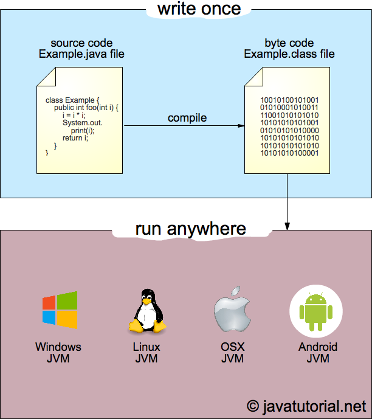

# Java Virtual Machine

JVM, 자바 가상 머신은 자바 어플리케이션을 클래스 로더로 읽어들여 자바 API로 실행시킨다.
JVM은 Java와 OS 사이의 중재자 역할을 하며,  Java가 OS에 상관없이 동작할 수 있도록 해준다.
스택 기반의 가상머신이며, 메모리 관리(Garbage Collection)를 수행한다.

## 자바 프로그램 수행 과정
1. 프로그램이 실행되면 JVM은 OS로부터 메모리를 할당 받는다. JVM은 이 메모리를 용도에 따라 나누어 관리한다.
2. 자바 컴파일러(javac)가 소스코드(.java)를 읽어들여 바이트코드(.class)로 변환시킨다.
3. 바이트코드(.class)는 Class Loader에 의해 JVM으로 로딩된다.
4. 로딩된 바이트코드(.class)는 Execution Engine을 통해 해석된다.
5. 해석된 바이트코드(.class)는 Runtime Data Area에 배치되어 실질적으로 수행된다.

## Reference
- https://asfirstalways.tistory.com/158
- https://javatutorial.net/jvm-explained
