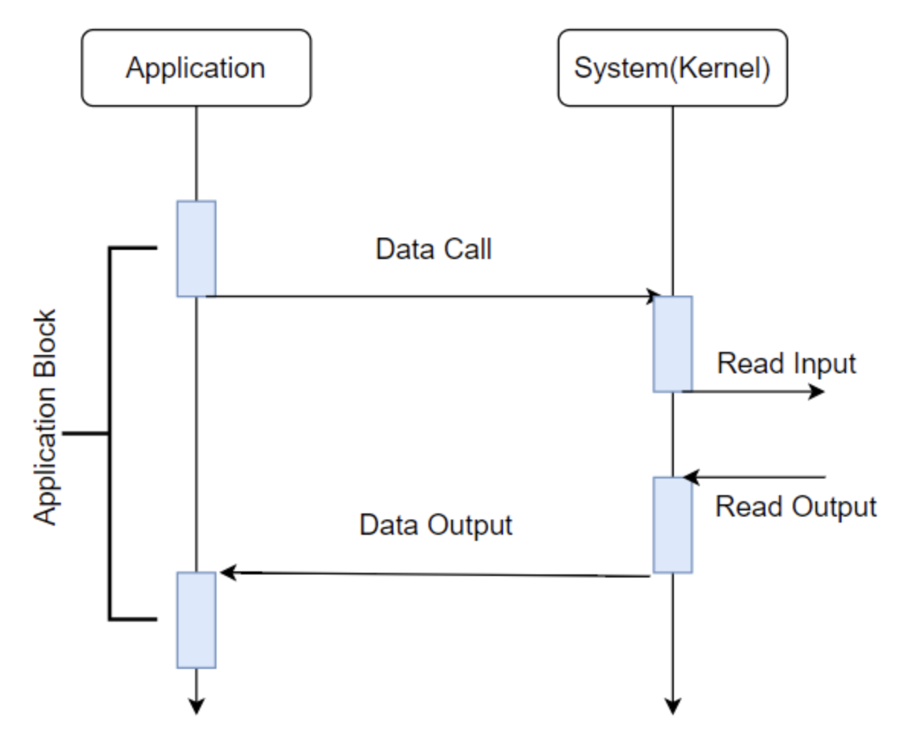
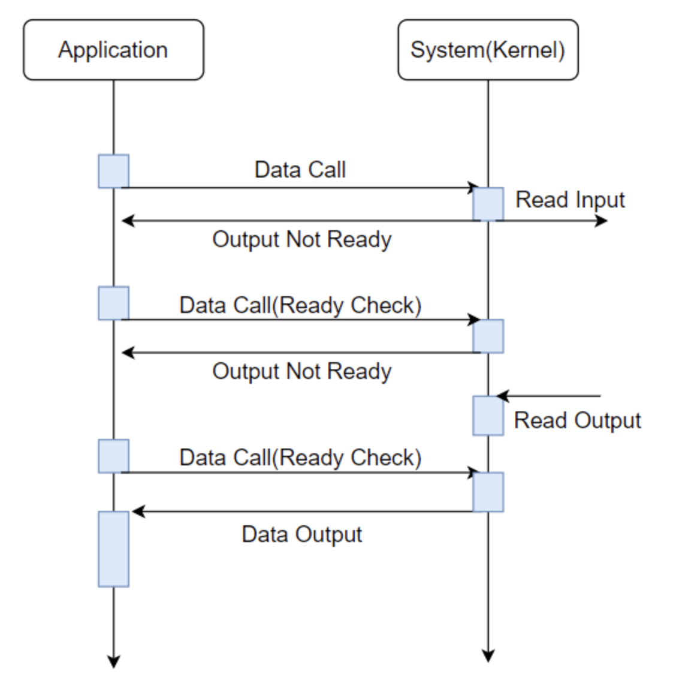
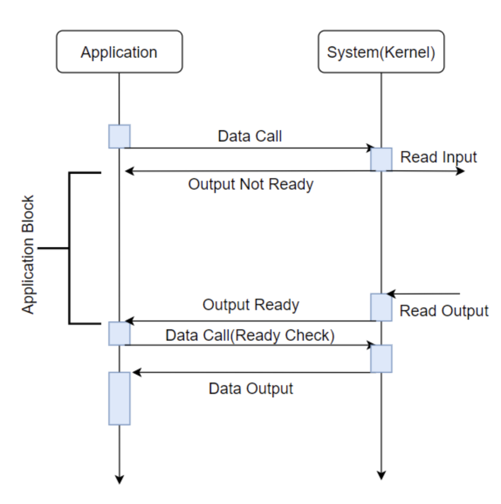
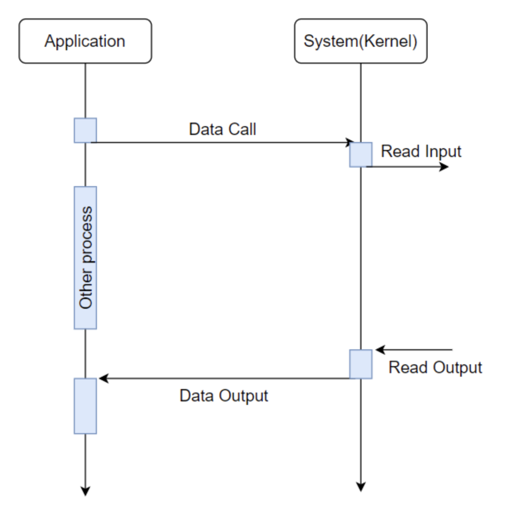

# blocking과 non-blocking, sync와 async

## blocking vs non-blocking
bocking과 non-blocking은 호출된 함수가 <b>결과를 바로 반환하는지</b> 아닌지로 구분된다.
- <b>blocking</b>: 호출된 함수가 결과를 곧바로 반환하지 않으므로 프로그램은 제어권이 돌아올 때까지 block된 체로 대기한다.
- <b>non-blocking</b>: 호출된 함수가 결과를 곧바로 반환하므로 프로그램은 작업이 완료되지 않더라도 block되지 않고 다른 일을 수행할 수 있다.

## synchronouse vs asynchronous
sync와 async는 요청한 작업의 <b>완료 여부를 신경쓰는 주체</b>가 어느쪽인지에 따라 구분된다.
- <b>synchronous</b>: 작업을 요청한 측에서 완료 여부를 확인한다. 작업이 완료될 때까지 대기(block)하거나, 반복적으로 완료 여부를 체크(non-block)하는 방식이 있다.
- <b>asynchronous</b>: 작업을 요청한 측에서 완료 여부를 신경쓰지 않는다. 반환 시의 작업 함수를 callback으로 넘겨주고 다른 일을 수행하는 등의 경우가 있다.

## IBM I/O Model

### 1. Synchronous Blocking

### 2. Synchronous Non-Blocking

### 3. Asynchronous Blocking

### 4. Asynchronous Non-Blocking

### References
- https://homoefficio.github.io/2017/02/19/Blocking-NonBlocking-Synchronous-Asynchronous/
- https://asfirstalways.tistory.com/348
- https://nesoy.github.io/articles/2017-01/Synchronized
