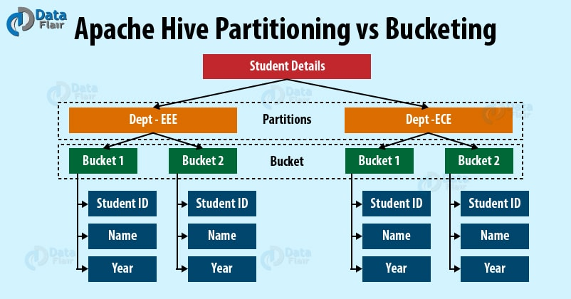

# Hive - Partition vs Bucket vs Index

## 1. Partition
Partitions provide segregation of the data at the hdfs level, 
creating sub-directories for each partition. 
Partitioning allows the number of files read and amount of data searched in a query to be limited. 
For this to occur however, partition columns must be specified in your WHERE clauses.

example
```
CREATE TABLE tbl(
  col1 STRING
) PARTITIONED BY (yymmdd STRING);
```


### 1.1. Static Partitioning
- <b>Insert input data files individually into a partition table</b> is Static Partition.
- Usually when loading files (big files) into Hive tables static partitions are preferred.
- Static Partition saves your time in loading data compared to dynamic partition.
- You "statically" add a partition in the table and move the file into the partition of the table.
- We can alter the partition in the static partition.
- You can get the partition column value from the filename, day of date etc without reading the whole big file.
- If you want to use the Static partition in the hive you should set property set ```hive.mapred.mode=strict```
- You should use where clause to use ```limit``` in the static partition.
- You can perform Static partition on "Hive Manage table" or "external table".

example
```
INSERT INTO TABLE tbl(yymmdd='20180510')
SELECT name
  FROM temp;
```

위와 같이 데이터를 입력하면 다음과 같은 폴더 구조로 데이터를 생성합니다
```
hdfs://[tbl 테이블 로케이션]/yymmdd=20180510/
```

### 1.2. Dynamic Partitioning
- Single insert to partition table is known as a dynamic partition.
- Usually, dynamic partition <b>loads the data from the non-partitioned table</b>.
- Dynamic Partition takes more time in loading data compared to static partition.
- When you have <b>large data stored in a table</b> then the Dynamic partition is suitable.
- If you want to partition a number of columns but <b>you don't know how many columns</b> then also dynamic partition is suitable.
- Dynamic partition there is no required where clause to use limit.
- we can't perform alter on the Dynamic partition.
- You can perform dynamic partition on "hive external table" and "managed table".
- If you want to use the Dynamic partition in the hive then the mode is in ```non-strict``` mode.

example
```
INSERT INTO TABLE tbl(yymmdd)
SELECT name,
       yymmdd
  FROM temp;
```

위와 같이 데이터를 입력할 때 temp 테이블의 yymmdd 칼럼에 20180510, 20180511 두 개의 데이터가 있으면 다음과 같이 생성합니다.
```
hdfs://[tbl 테이블 로케이션]/yymmdd=20180510/
hdfs://[tbl 테이블 로케이션]/yymmdd=20180511/
```


## 2. Index
Indexes are new and evolving (features are being added) but currently Indexes are limited to single tables 
and cannot be used with external tables. 
Creating an index creates a separate table. 
Indexes can be partitioned (matching the partitions of the base table). 
Indexes are used to speed the search of data within tables.

## 3. Bucket
In Hive Tables or partition are subdivided into buckets based on the hash function of a column in the table 
to give extra structure to the data that may be used for more efficient queries.


## Partition vs Bucketing



## Reference
- https://data-flair.training/blogs/hive-partitioning-vs-bucketing/
- https://data-flair.training/blogs/apache-hive-partitions/
- https://wikidocs.net/23557
